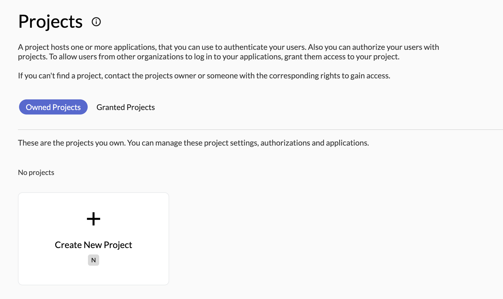
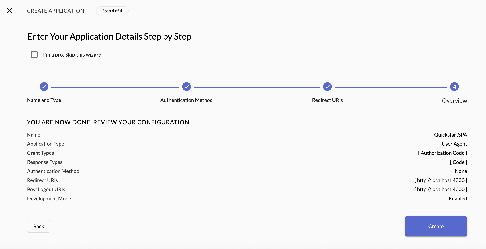
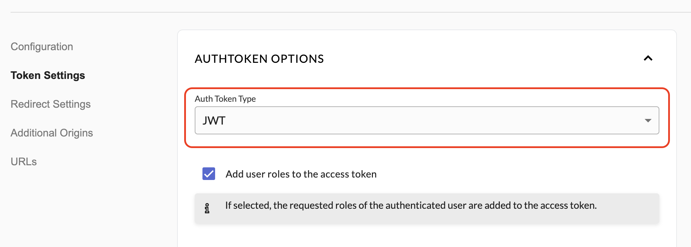

# Zitadel JS Quickstart

This is a simple vanilla JS SPA demonstrating authentication with **Zitadel** using OIDC.
This app uses [oidc-client-ts](https://github.com/authts/oidc-client-ts) to handle OpenID Connect login flows.

---

## Prerequisites

- Node.js installed on your machine
- A **Zitadel** instance

---

## Setup Instructions

1. **Log into the Zitadel Customer Portal**  
   Go to the [Zitadel Customer Portal](https://zitadel.com/admin/dashboard)

2. **Create an Instance**  
   - Choose a region and create your new instance.

3. **Create a Project**  
   - Inside your instance, go to Projects -> Create New Project



4. **Create an Application**  
   - New **"User Agent"**
   - Select **"PKCE"**
   - Enable **"Development Mode"**
   - Configure your **Redirect URI** and **Post Logout URI** (`http://localhost:4000` for local testing)
   - Click **"Continue"** and **"Create"**
   - Copy the **"Client ID"**



5. **Change your token type to `JWT` in your application settings**  



6. **Configure `auth.js`**  
   - Open `public/js/auth.js` and replace the placeholder values with your application info:

```js
const config = {
    authority: 'https://CUSTOM_DOMAIN',  // Your Zitadel instance
    client_id: 'CLIENT_ID',                        // Client ID from Zitadel
    redirect_uri: 'http://localhost:4000',             // Redirect URI you set in Zitadel
    post_logout_redirect_uri: 'http://localhost:4000', // Optional logout redirect URL
    response_type: 'code',
    scope: 'openid profile email',                     // Scopes you want
    code_challenge_method: 'S256'
};
```

7. **Run `npm install & npm start`**  
